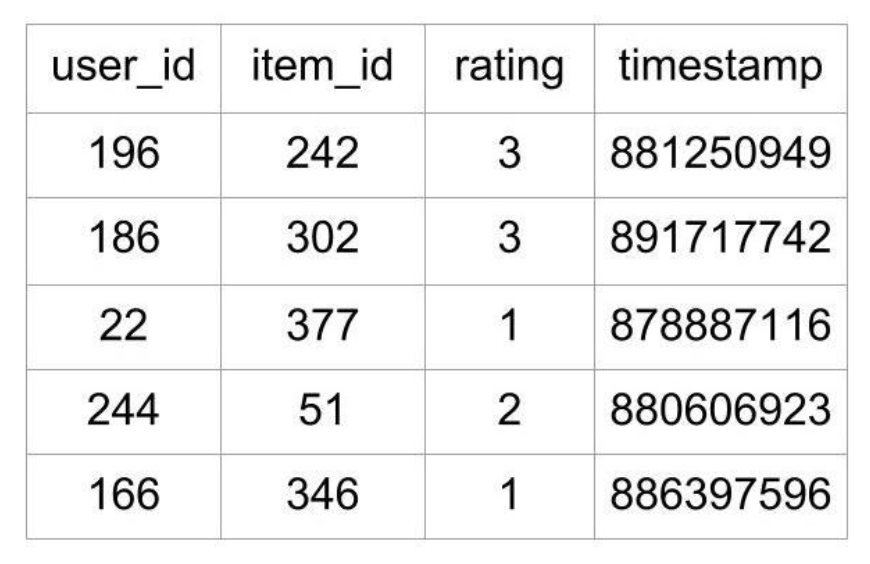

# The Magic behind Recommendation Systems

Oftentimes, we are surprised by the accuracy of recommendations on what to buy on Amazon, watch on Netflix, or listen on Spotify. We feel that somehow these companies know how our brain works and monetizing this magical guessing game. They have a deep foundation on behavioral sciences, and our job is to make all these concepts real in a way that is both easy to understand and covers the most important concepts. 

```
Remember: People are extremely predictable. Behavior indicates personality.
Personality builds our conduct and our conduct determines our decisions.
```


More formally, recommendation systems are a subclass of information filtering systems. In short words, information filtering systems remove redundant or unwanted data from a data stream. They reduce noise at a semantic level. There’s plenty of literature around this topic, from astronomy to financial risk analysis. 
There are two main types of recommendations systems:
  * Collaborative Filtering
  * Content-Based Filtering

We’ll explore both types, with examples, pros, and cons. There isn’t a perfect system, but there are solutions better-suited for specific needs, as well as different levels of complexity. 

## Collaborative Filtering

The cornerstone of this filtering type is the user/item feedback loops. 

This feedback can be user ratings, thumbs up and down, or even how much a user engages with specific content. 
Collaborative filtering has two senses, a narrow one and a more general one.

Within the narrower sense, collaborative filtering is a method of constructing automatic predictions (filtering) regarding the interests of a user, by aggregation preferences or data collection from several users (collaborating). 

The underlying assumption of the collaborative filtering approach is that if person A has the same opinion as a person B on an issue, A is more likely to have B’s opinion on a different issue than that of a randomly chosen person. Netflix could use collaborative filtering to predict which TV show a user will like, given a partial list of that user’s tastes (likes or dislikes). Note that these predictions are specific to the user, but use information gleaned from many users.


Ratings and Reviews

A collaborative filtering formula represents a client as an N-dimensional vector N, wherever N is that the variety of distinct catalog data. The elements of the vector are positive for accessed or positively rated content and negative for negatively rated information. 


Computationally speaking, collaborative filtering is O(MN) within the worst case, where M is the number of customers and N the number of product catalog data. In practice, since the average client vector is very thin, performance tends to be nearer O(M+N)


Customers and tastes (MxN matrix)

In a more general sense, collaborative filtering is the process of filtering for information or patterns using techniques involving collaboration among multiple agents, viewpoints, data sources, etc. It typically involves very large data sets. Some public ones can be found [here](https://github.com/caserec/Datasets-for-Recommender-Systems).

We have different types of Collaborative filtering: 
  * User-User
  * Item-Item
  * User-Item

### User-User
The most commonly used recommendation algorithm follows the “people like you like that” logic. It recommends items that similar users liked before. The **similarity between two users** is computed from the number of items they have in common in the dataset. This algorithm is efficient when the number of users is smaller than the number of items. A good example is a medium-sized e-commerce website with millions of products. The major disadvantage is that adding new users is expensive since it requires updating all similarities between users.

### Item-Item 
It uses the same approach but reverses the view between users and items. It follows the logic “if you like this you might also like that”. In other words, it recommends items that are similar to the ones you previously liked. As before the similarity between two items is computed using the number of users they have in common in the dataset. This algorithm is better when the number of items is much smaller than the number of users. An example could be a large-scale online shop when your items don’t change too often. The main disadvantage is that item-item similarity tables have to be precomputed. Updating this table when adding a new item is expensive.

### User-Item
It combines both approaches to generate recommendations. The simplest ones are based on [matrix decomposition](https://machinelearningmastery.com/introduction-to-matrix-decompositions-for-machine-learning/) techniques. The goal is to create low-dimensional vectors (“embeddings”) for all users and all items, such that multiplying them together can uncover if a user likes an item or not. 

The user-item matrix is a basic foundation of traditional collaborative filtering techniques, and it suffers from a data sparsity problem.

Matrix decomposition can be done using Singular Value Decomposition ([SVD](https://medium.com/@m_n_malaeb/singular-value-decomposition-svd-in-recommender-systems-for-non-math-statistics-programming-4a622de653e9)), but it’s computationally expensive and doesn’t scale well. For medium-sized datasets, Alternating Least Square ([ALS](https://towardsdatascience.com/prototyping-a-recommender-system-step-by-step-part-2-alternating-least-square-als-matrix-4a76c58714a1)) could be a good alternative. For a large dataset, only the [SGD](https://towardsdatascience.com/overview-of-matrix-factorisation-techniques-using-python-8e3d118a9b39) algorithm will be able to scale, but always needing considerable computational power.

Once the users’ embeddings and the items’ embeddings have been pre-computed recommendations can be served in real-time. Another benefit of this approach is that you can learn more about users and items using their embeddings. 

User-Item algorithms share the drawback that there is no efficient method to update the embeddings after adding a new item or a new user.

As in the personalized recommendation scenario, the introduction of new users or new items can cause the **cold-start problem**, as there will be insufficient data on these new entries for the collaborative filtering to work accurately. In order to make appropriate recommendations for a new user, the system must first learn the user’s preferences by analyzing past voting or rating activities. The collaborative filtering system requires a substantial number of users to rate a new item before that item can be recommended.

In a further article we can dive deeper into the two main types of collaborative filtering systems:

  [Model-Based](https://www.researchgate.net/publication/321753015_Model-based_approach_for_Collaborative_Filtering): Uses different techniques, like, data mining, machine learning algorithms to predict users’ ratings of unrated items. Typically uses clustering-based algorithms (k-nearest neighbors or KNN), Matrix factorization techniques (SVD), Probabilistic Factorization or Deep learning (Neural Nets). 
  [Memory-Based](https://medium.com/@kyasar.mail/recommender-systems-memory-based-collaborative-filtering-methods-b5d58ca8383): Uses user rating data to compute the similarity. It typically finds similarity using cosines or Pearson correlations and takes a weighted average of ratings. This approach has easier explainability but doesn’t scale well. 

## Content-Based
All the previous models suffer from what is called the cold-start problem.

Content-based filtering methods are based on a description of the item and a profile of the user’s preferences. These methods are best suited to situations where there is known data on an item (name, location, description, etc.), but not on the user. Content-based recommenders treat recommendation as a user-specific classification problem and learn a classifier for the user’s likes and dislikes based on product features.

In this system, keywords are used to describe the items and a profile is built to indicate the type of item this user likes. The algorithms try to recommend items that are similar to those that a user liked in the past, or is examining in the present. This approach has its roots in information retrieval and information filtering research.

The recent progress of pattern recognition in machine learning unlocked great improvements in a content-based model using information extracted from images or text descriptions.

The approach is identical to the previous User-User or Item-Item algorithms, except that the similarities are computed using **only content-based features.**


Collaborative Filtering vs Content-Based Filtering


## Case Studies
For the following case studies, we’ll use Python and a public dataset. 

Specifically, we’ll use [MovieLens](https://grouplens.org/datasets/movielens/) dataset collected by GroupLens Research. A file containing [MovieLens 100k dataset](https://grouplens.org/datasets/movielens/100k/) is a stable benchmark dataset with 100,000 ratings given by 943 users for 1682 movies, with each user having rated at least 20 movies.
This dataset consists of many files that contain information about the movies, the users, and the ratings given by users to the movies they have watched. The ones that are of interest are the following:

  **u.item**: the list of movies
  **u.data**: the list of ratings given by users

The first five lines of the file look like this:

MovieLens 100k dataset

The file contains what rating a user gave to a particular movie. This file contains 100,000 ratings, which will be used to predict the ratings of the movies not seen by the users.

### Memory-based Collaborative Filtering

On this variation, statistical techniques are applied to the entire dataset to calculate the predictions.

To find the rating **R** that a user **U** would give to an item I, the approach includes:
  * Finding users similar to **U** who have rated the item **I**
  * Calculating the rating **R** based the ratings of users found in the previous step

Considering that each user is a vector, scikit has a function that calculates the cosine distance for each vector. 

```
>>> from scipy import spatial
>>> a = [1, 2]
>>> b = [2, 4]
>>> c = [2.5, 4]
>>> d = [4.5, 5]

>>> spatial.distance.cosine(c,a)
0.004504527406047898

>>> spatial.distance.cosine(c,b)
0.004504527406047898

>>> spatial.distance.cosine(c,d)
0.015137225946083022

>>> spatial.distance.cosine(a,b)
0.0
```

The lower angle between the vectors of **C** and **A** gives a lower cosine distance value. 

Note that users **A** and **B** are considered absolutely similar in the cosine similarity metric despite having different ratings. This is actually a common occurrence in the real world, and the users like the user **A** are what you can call **tough raters**. An example would be a movie critic who always gives out ratings lower than the average, but the rankings of the items in their list would be similar to the **average raters** like B.

To factor in such individual user preferences, we can normalize ratings to remove their biases. We can do this by subtracting the average rating given by that user to all items from each item rated by that user. 

Here’s what this **normalization** would look like:
  * For user **A**, the rating vector [1, 2] has the average 1.5. Subtracting 1.5 from every rating would give you the vector [-0.5, 0.5].
  * For user **B**, the rating vector [2, 4] has the average 3. Subtracting 3 from every rating would give you the vector [-1, 1].

Doing the same for users C and D, we can see that the ratings are now adjusted to give an average of 0 for all users, which brings them all to the same level and removes their biases.

The cosine of the angle between the adjusted vectors is called centered cosine. This approach is normally used when there are a lot of missing values in the vectors, and you need to place a common value to fill up the missing values.

A good choice to fill the missing values could be the average rating of each user, but the original averages of user **A** and **B** are 1.5 and 3 respectively, and filling up all the empty values of **A** with 1.5 and those of **B** with 3 would make them dissimilar users. This problem is solved by our normalization because the **centered average** of both users is 0, which brings the idea that all missing values are 0.

After we have determined a list of users similar to a user U, we can calculate R that U would give to a certain item I. We can do this in multiple ways.

We can predict that a user’s rating R for an item I will be close to the average of the ratings given to I by the top 5 or top 10 users most similar to U. The mathematical formula for the average rating given by n users would look like this:


Average rating by N similar users

This formula shows that the average rating given by the n similar users is equal to the sum of the ratings given by them divided by the number of similar users, which is n.

There will be situations where the n similar users that you found are not equally similar to the target user **U**. The top 3 of them might be very similar, and the rest might not be as similar to **U** as the top 3. In that case, you could consider an approach where the rating of the most similar user matters more than the second most similar user and so on. The weighted average can help us achieve that.

In the weighted average approach, you multiply each rating by a similarity factor(which tells how similar the users are). By multiplying with the similarity factor, you add weights to the ratings. The heavier the weight, the more the rating would matter.

The similarity factor, which would act as weights, should be the inverse of the distance discussed above because less distance implies higher similarity. For example, you can subtract the cosine distance from 1 to get a cosine similarity.

With the similarity factor **S** for each user similar to the target user **U**, we can calculate the weighted average using the following formula:


In the above formula, every rating is multiplied by the similarity factor of the user who gave the rating. The final predicted rating by user **U** will be equal to the sum of the weighted ratings divided by the sum of the weights.

With a weighted average, we give more consideration to the ratings of similar users in order of their similarity.

This technique is an example of User-User CF. If we use the rating matrix to find similar items based on the ratings given to them by users, then the approach would be Item-Item CF.

Although, the Item-Item approach performs poorly for datasets with browsing or entertainment-related items such as MovieLens. Such datasets see better results with matrix factorization techniques, which we’ll see in the Model-based CF section. 

### Model-based Collaborative Filtering
In the user-item matrix, there are two dimensions:
  1. The number of users
  2. The number of items

If the matrix is mostly empty (sparse), reducing dimensions can improve the performance of the algorithm in terms of both space and time. One of the most common methods for this is called matrix factorization.

**Matrix factorization** can be seen as breaking down a large matrix into a product of smaller ones. This is similar to the factorization of integers, where 12 can be written as 6 x 2 or 4 x 3. In the case of matrices, a matrix **A** with dimensions m x n can be reduced to a product of two matrices **X** and **Y** with dimensions m x p and p x n respectively.

Depending on the algorithm used for dimensionality reduction, the number of reduced matrices can be more than two as well.

The reduced matrices actually represent the users and items individually. The **m** rows in the first matrix represent the **m** users, and the **p** columns tell you about the features or characteristics of the users. The same goes for the item matrix with **n** items and **p** characteristics. Here’s an example of how matrix factorization looks:


In the image above, the matrix is reduced into two matrices. The one on the left is the user matrix with m users, and the one on top is the item matrix with n items. The rating 4 is reduced or factorized into:
  1. A user vector (2, -1)
  2. An item vector (2.5, 1)

The two columns in the user matrix and the two rows in the item matrix are called latent factors and are an indication of hidden characteristics about the users or the items. A possible interpretation of the factorization could look like this:

  * Assume that in a user vector (u, v), u represents how much a user likes the Horror genre, and v represents how much they like the Romance genre.
  * The user vector (2, -1) thus represents a user who likes horror movies and rates them positively and dislikes movies that have romance and rates them negatively.
  * Assume that in an item vector (i, j), i represents how much a movie belongs to the Horror genre, and j represents how much that movie belongs to the Romance genre.
  * The movie (2.5, 1) has a Horror rating of 2.5 and a Romance rating of 1. Multiplying it by the user vector using matrix multiplication rules gives you (2 * 2.5) + (-1 * 1) = 4.
  * So, the movie belonged to the Horror genre, and the user could have rated it 5, but the slight inclusion of Romance caused the final rating to drop to 4.

The factor matrices can provide such insights about users and items, but in reality, they are usually much more complex. The number of such factors can be anything from one to hundreds or even thousands. This number is one of the things that need to be optimized during the training of the model.

In the example, you had two latent factors for movie genres, but in real scenarios, these latent factors need not be analyzed too much. These are patterns in the data that will play their part automatically whether you decipher their underlying meaning or not.

The number of latent factors affects the recommendations in a manner where the greater the number of factors, the more personalized the recommendations become. But too many factors can lead to overfitting in the model.

```
# load_data.py

import pandas as pd
from surprise import Dataset
from surprise import Reader

# This is the same data that was plotted for similarity earlier
# with one new user "E" who has rated only movie 1
ratings_dict = {
   "item": [1, 2, 1, 2, 1, 2, 1, 2, 1],
   "user": ['A', 'A', 'B', 'B', 'C', 'C', 'D', 'D', 'E'],
   "rating": [1, 2, 2, 4, 2.5, 4, 4.5, 5, 3],
}

df = pd.DataFrame(ratings_dict)
reader = Reader(rating_scale=(1, 5))

# Loads Pandas dataframe
data = Dataset.load_from_df(df[["user", "item", "rating"]], reader)
# Loads the builtin Movielens-100k data
movielens = Dataset.load_builtin('ml-100k')
```

### K-Nearest Neighbours (k-NN) and Matrix Factorization. 
Surprise library has many algorithms that we can use very easily, k-NN.

``` 
# recommender.py

from surprise import KNNWithMeans

# To use item-based cosine similarity
sim_options = {
   "name": "cosine",
   "user_based": False,  # Compute  similarities between items
}
algo = KNNWithMeans(sim_options=sim_options)
```

That we can train and predict using k-NN. 

```
>>> from load_data import data
>>> from recommender import algo

>>> trainingSet = data.build_full_trainset()

>>> algo.fit(trainingSet)
Computing the cosine similarity matrix...
Done computing similarity matrix.
<surprise.prediction_algorithms.knns.KNNWithMeans object at 0x7f04fec56898>

>>> prediction = algo.predict('E', 2)
>>> prediction.est
4.15

```

And finally, we can fine tune our hyperparameters and root mean square error. 

```
from surprise import KNNWithMeans
from surprise import Dataset
from surprise.model_selection import GridSearchCV

data = Dataset.load_builtin("ml-100k")
sim_options = {
   "name": ["msd", "cosine"],
   "min_support": [3, 4, 5],
   "user_based": [False, True],
}

param_grid = {"sim_options": sim_options}

gs = GridSearchCV(KNNWithMeans, param_grid, measures=["rmse", "mae"], cv=3)
gs.fit(data)

print(gs.best_score["rmse"])
print(gs.best_params["rmse"])
```

### Singular Value Decomposition Recommender
As a variation, we can run a recommender algorithm using Singular Value Decomposition (SVD), instead of k-NN. 

```
from surprise import SVD
from surprise import Dataset
from surprise.model_selection import GridSearchCV

data = Dataset.load_builtin("ml-100k")

param_grid = {
   "n_epochs": [5, 10],
   "lr_all": [0.002, 0.005],
   "reg_all": [0.4, 0.6]
}
gs = GridSearchCV(SVD, param_grid, measures=["rmse", "mae"], cv=3)

gs.fit(data)

print(gs.best_score["rmse"])
print(gs.best_params["rmse"])
```

The output of the above program is as follows:
```
0.9642278631521038
{'n_epochs': 10, 'lr_all': 0.005, 'reg_all': 0.4}
```

## References
Suresh Chandra Satapathy, Vikrant Bhateja, Amit Joshi. “[Proceedings of the International Conference on Data Engineering and Communication Technology](https://www.amazon.com/s?k=9789811016783&i=stripbooks&linkCode=qs)”. 2016. 

[Build a Recommendation Engine With Collaborative Filtering - Real Python](https://realpython.com/build-recommendation-engine-collaborative-filtering/)

Terveen, Loren; Hill, Will (2001). “[Beyond Recommender Systems: Helping People Help Each Other](http://www.grouplens.org/papers/pdf/rec-sys-overview.pdf)”. Addison-Wesley. p. 6. 

Badrul Sarwar, George Karypis, Joseph Konstan, and John Riedl (2001). “[Item-Based Collaborative Filtering Recommendation Algorithms](http://files.grouplens.org/papers/www10_sarwar.pdf)”. GroupLens Research Group/Army HPC Research Centre. The first paper published on item-based recommenders.

David A. Goldberg, David A. Nichols, Douglas B. Terry. “[Using collaborative filtering to weave an information tapestry](https://scinapse.io/papers/1966553486)”. Communications of The ACM. 1991. The first use of the term collaborative filtering.

Library [LightFM](https://github.com/lyst/lightfm): a hybrid recommendation algorithm in Python.

Library [Python-recsys](https://github.com/ocelma/python-recsys): a Python library for implementing a recommender system.

Library [Surprise](https://github.com/NicolasHug/Surprise): a Python scikit building and analyzing recommender systems that deal with explicit rating data.

Aggarwal, Charu C. (2016). “Recommender Systems: The Textbook”. Springer. 

Peter Brusilovsky (2007). “The Adaptive Web.” p. 325.

Aditya, P. & Budi, Indra & Munajat, Qorib. (2016). “A comparative analysis of memory-based and model-based collaborative filtering on the implementation of recommender system for E-commerce in Indonesia: A case study PT X”. p. 303–308

