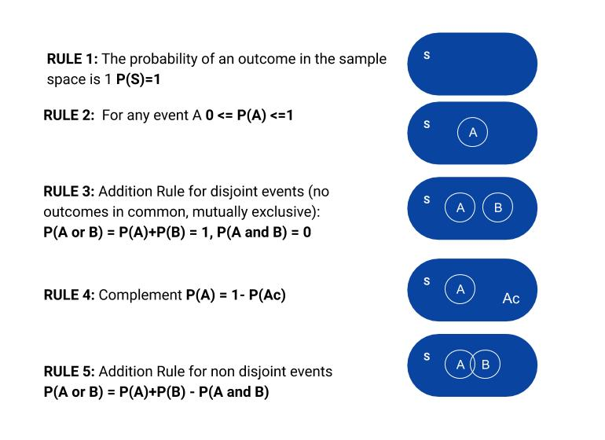
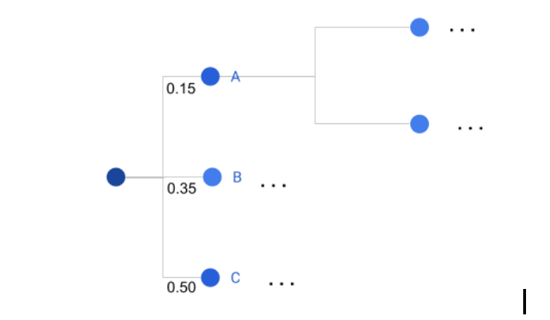

     
# UNDERSTANDING BASIC STATISTICS FOR MACHINE LEARNING MODELS - PART 1

If you want to understand machine learning algorithms, it is very important to have basic statistical knowledge so as to understand what is behind them. Understanding how the algorithm operates gives you the possibility of configuring the model according to what you need, as well explaining with more confidence the results obtained from the execution of the model. 

This series of articles presents a very brief summary that tries to list all basic statistical concepts necessary to face machine learning problems. The articles are presented in a schematic way since the main purpose is to start being familiar with terminologies and definitions that are going to be used in machine learning algorithms.

In this first section an outline of definitions about probability and matrices is provided.  

## Probability 
Firstly, some probability terms are described. Those terms are being used then to explain the fundamentals of the algorithms. 

**Sample:** set of observations drawn from a population. It is necessary to use samples because it is impossible to study all the population. Population refers to the set of all the data. 

**Sample space:** set of all possible outcomes that can happen in a chance situation.

**Event:** a subset of the sample space. A probability is assigned to the event.

**Probability:** a measure of the likelihood that an event will occur in a random experiment. It is quantified as a number between 0 and 1, where. The higher, the more likely is the occurrence of the event. 

*Probability = # desired outcomes / # possible outcomes*

### Probability rules

     
**Independent events:** The occurrence of one event has no effect on the probability of occurrence of the other event. If A,B are independent, then *P(A and B) = P(A) x P(B)*

**Joint probability:** chance of an outcome of having two events occurring together at the same time.

**Marginal probability:** the probability of observing an outcome with a single variable, regardless of its other variables. 

**Conditional probability:** the conditional probability of an event A given that the event B occurs. It is written like: *P(A|B) = P(A and B) / P(B)*

**Multiplication rule:** 
*P(A and B)= P(A|B) x P(B)*
*P(A and B)= P(B|A) x P(A)*

**Bayes Rule:** *P(A|B)=P(B|A) x P(A)/P(B)*

### Representation

**Probability tree:** diagram to represent different outcomes in function of the occurrence of the events. 

 
    
 Probability table: A probability table is another way  of representing probabilities. 

| Event         | Probability   |
| --------------|:-------------:| 
| A             | 0.15          | 
| B             | 0.35          | 
| C             | 0.50          | 

## Random variables
A **random variable** describes the probability for an uncertain future numerical outcome of a random process. It is a function that maps an outcome of a random experiment to a numerical value.
For instance, in the case of the experiment of flipping a coin twice, the sample space is S={HH,TT,HT,TH}. Where H corresponds to head and T to tail respectively. Therefore, let be a random variable X the number of heads, it would be a function that from the outcome determines how many heads were flipped.   
Thus, X takes the following values:  

 
HH -> 2  
TT -> 0  
HT -> 1  
TH -> 1  

Then, the random variable X can take the values {0,1,2}, corresponding to the possible cases. Observe that although the sample space had 4 cases, the random variable can only take 3 values. 

**Discrete random variable:** the set of possible outcomes is finite. 

**Continue random variable:** can take any value within an interval. 

[**Expected value:**](https://towardsdatascience.com/what-is-expected-value-4815bdbd84de) weighted average, based on probability to weigh the possible outcomes. It is the sum of all gains multiplied by each probability. Where x1..xn are values for the sample space of the discrete random variable X. Reaching to the following [formula](https://www.statisticshowto.com/probability-and-statistics/expected-value/):

%3DX_1*p(X_1)%20%5C%2B%20X_2*p(X_2)%20%2B%20...%20%2B%20X_n*p(X_n))

**Variance:** intents to describe how spread is the data from the mean value. It is defined as the expected value of the squared deviation of X from the mean m. 

![Var(X)= E\[(X-m)^2\]](https://render.githubusercontent.com/render/math?math=Var(X)%3D%20E%5B(X-m)%5E2%5D) 

So, here the function is %3D(X-m)%5E2), applying the formula of the expected value of a function, we get: 
![Var(X)= E\[(X-m)2\]=(x_1-m)^2*p(x_1)+(x_2-m)^2+...+(x_n-m)^2=\sum(x_i - m)^2p(x_i)](https://render.githubusercontent.com/render/math?math=Var(X)%3D%20E%5B(X-m)2%5D%3D(x_1-m)%5E2*p(x_1)%2B(x_2-m)%5E2%2B...%2B(x_n-m)%5E2%3D%5Csum(x_i%20-%20m)%5E2p(x_i))

**Standard deviation:** It is the square root of Var(X).  It is denoted as %7D). You can find a clear explanation in this video: [https://www.youtube.com/watch?v=2egl_5c8i-g](https://www.youtube.com/watch?v=2egl_5c8i-g).

[**Covariance:**](https://corporatefinanceinstitute.com/resources/knowledge/finance/covariance/)  measures the variance between two random variables.

%3D%5Csum%5Cfrac%7B(X_i%20-%20%5Cbar%20X)(Y_i%20-%20%5Cbar%20Y)%7D%7Bn%7D)

- Positive covariance: the variables tend to move in the same direction.
- Negative covariance: the variables tend to move in inverse directions.
It is important to notice that the covariance shows the direction of the relationship between the two variables, but not the strength of it.

**Correlation:** measures the strength of the relationship between variables.

%3D%5Csum%5Cfrac%7B(X_i%20-%20%5Cbar%20X)(Y_i%20-%20%5Cbar%20Y)%7D%7Bn%7D)

- Positive correlation: the variables are correlated and they move in the same direction.
- Negative correlation: the variables are correlated and they move in opposite directions.
- No correlation: when the coefficient is 0 does not exist any relationship between the variables. It means that the variables are independent. 

**Distance matrix:** squared matrix that contains the distance between the variables of the set. The most common distance used is the Euclidean distance, but there are other distances that can be used.

**I.i.d (Identically independent distributed) random variables:** when two random variables are identically (have the same probability distribution) and are mutually independent. Often this assumption is applied in machine learning algorithms in order to imply that all samples come from the same process which does not depend from past generated samples.

## Matrices 
Basic knowledge about matrices is necessary in order to understand some of the math behind the algorithms and handle images. 

 It is a matrix with m rows and n columns. 

**Square matrix:** when m=n

**Column vector:** is a matrix with only 1 column

**Row vector:** a matrix with only 1 row

**Transpose matrix:** interchange rows and columns. Notation: )

**Diagonal matrix:** has 0 values except the main diagonal

**Symmetric matrix:** square matrix unchanged when it is transposed. 

**Identity matrix:** diagonal matrix with all elements of the diagonal equal to 1. Notation: I

**Matrix multiplication:** 

**Element-wise multiplication:** 

**Inverse matrix:** 

**Trace:** sum of the elements of the diagonal.

**Determinant:** Notation: %3D%7CA%7C)

**Eigenvalues and eigenvectors** 

 is a scalar and is called the eigenvalue of A    
 is the eigenvector belonging to .   
Any nonzero multiple of   will be an eigenvector.  
To find :  

## Roadmap 
Cheat sheets are very useful to have all the concepts in one document, [here](images/Probability_and_Matrices_Roadmap.pdf) you can find a cheat sheet for this part. 

