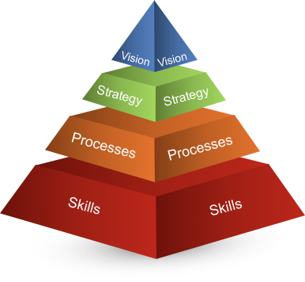

# The Value Pyramid

*[Anthony Figueroa](https://www.rootstrap.com/tech-blog/author/anthfig/) is CTO on the Rootstrap team and writes about his experience tackling difficult problems for  our many clients. You can also follow Anthony on [LinkedIn](https://uy.linkedin.com/in/figueroaanthony).*

---

In every organization or company, whether it is an independent business firm or an international conglomerate, the role of the members and the obligations they undertake can vary depending on their field of expertise.
Roles can be categorized in many different ways, and one of the key identification qualities of a role can be determined by looking for its appropriate place on the value chain system, commonly known as the Value Pyramid.

The value pyramid incorporates four different levels of professional sophistication; skills, processes, strategy, and vision.
Now, imagine that you are an employee of a company. Delivering value to that company and their clients could be modified and adjusted based on the information found on the value pyramid.

---

## The Challenge of Skills and Processes

The base layer comprises of your 'Skills' and these are technical skills, knowledge, and execution. Skills do not always share a direct correlation with one's education, since they could very well be attained through self-learning methods.

Needless to say that a workplace which employs skillful members based on the merit of their competence is on the right path.

With the foundation of skills taken care of, there comes the need to implement principles and a work frame. As an agency with specific standards, processes could be the most effective way to reach peak efficiency and maximum productivity.

When you start to follow down a path of principled work, you are overcoming the obstacle of the second layer of the pyramid that is dedicated to 'Processes'.

## Why Skills and Competence Are Not Enough!

As you may already know, value is a subjective matter. With the lines of idealism blurred and changing from one person to another, an organization with a process criterion would be considered more effective and competent.

Remember, a firm that solely relies on 'skills' is ultimately doomed to fail in the long run, not to mention that what distinguishes them in one particular field will soon become modest in the eyes of their clients.

When you fail to challenge yourself as a company, you fail in the competitive scene of the industry, and your services become a cheap and common commodity.

## Why Do You Need Strategy?

The third tier of the value pyramid is dedicated to 'Strategy' and strategic thinking. It is mandatory to have a great understanding of the business itself and the landscape of the industry in order to come up with a powerful strategy.

You have to combine this understanding with planning and execution. Simply put, your strategy is the answer to the "how" questions that determine your core objectives. In order to become a reliable strategic partner, you need to have practical planning to realize the vision of your client.

But being a strategic partner is not just about planning or execution. With an improvement of skills and processes, which are the first two tiers of the value pyramid, you can modify opportunities, change consequences, and come up with strategic decisions.

---

## Your Ultimate Vision
As is the case with the context of every hierarchical pyramid, the top level of the value pyramid teaches us about what it means to have 'Vision!'

The vision is the ultimate dream. Your vision will set indicators that represent the ideal version of your system and that manifests in the most valuable things that you can incorporate into your company.

Vision is often set by the founders or the leaders of a system or company. Achieving vision and proper perspective is not simple, nor is it possible without mastering the first three tiers.

## The Importance of Statements and Objectives

A proper vision is broken down to clear and vivid statements that describe the depth of your perspective. The statements should be understandable by members. They should encompass local perspectives and be relatable enough so as to inspire the members of the company.

Last but not least, these statements should give everyone the incentive they require to put in maximum effort and dedicate each and every move towards the realization of the collective vision.
You need to develop mission statements as well, which will help you with the 'what' and the 'why' through your business plan, because having some focused objectives is an absolute necessity.

Objectives will help specify the steps that need to be taken in order to accomplish the mission and eventually, realize the vision. Objectives must turn processes (second tier of the pyramid) into a detailed plan. How do you approach these objectives? Well, the best tool to jumpstart these objectives is strategy.

In a sense of the word, strategies are related to the vision through the mission and objectives. Evidently enough, the vision is the most important element of this system which brings all the other values together.

## Rootstrap and the Value Pyramid

A company that aptly deploys the value pyramid can effectively create a more prosperous future for their clients. On another note, the values of the client are important too. Some clients only require skills for their job, while others may challenge you to utilize processes, strategic thinking, and higher vision in order to comply with their needs.

Here at Rootstrap, we believe in the importance of creating value at all levels as a company, striving to create the perfectly-balanced value pyramid to give our clients the best that they can possibly expect from an organization.

The trial is not merely an indication of our determination or a roadmap towards excellence; in fact, the clients ARE our ultimate vision. The vision that we aspire to realize on a daily basis.

*If you are the owner of a digital platform and would like to discuss the challenges you face on a technical level, contact us [here](https://www.rootstrap.com/contact). Alternatively, you can reach out to [anthony@rootstrap.com](mailto:anthony@rootstrap.com).