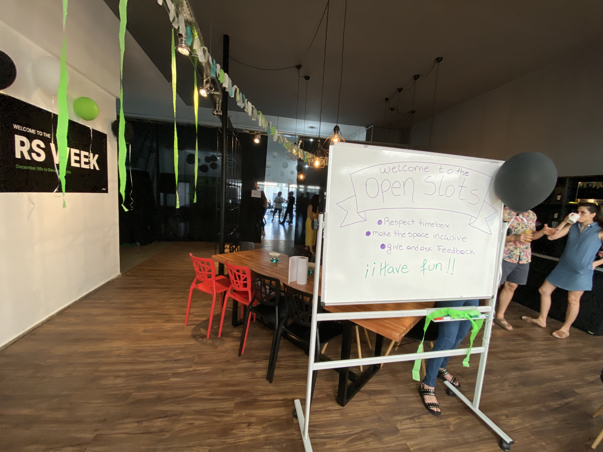
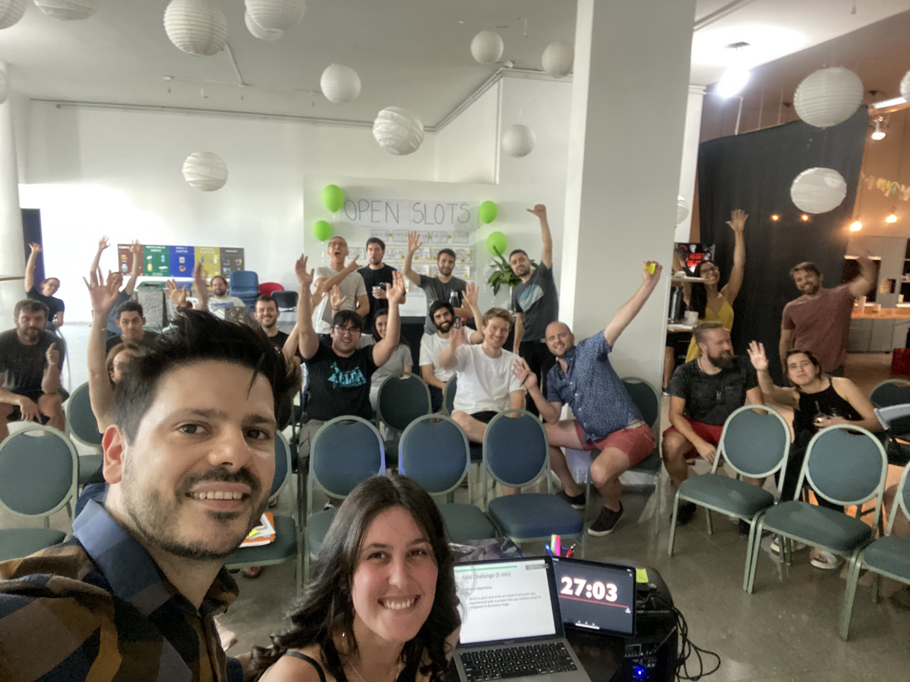

# What I've Learned From Rootstrap Week

Three weeks ago we had a massive company retreat in Montevideo denominated *Rootstrap week*. Team members traveling from all around the globe for a one whole week full of laughs, personal stories, lessons learned, *fuck up* tales, and new innovative ideas heading the promising 2020.

A week in which communication and co-creation were the most resonating concepts. One full day of internal talks, shaped as a major conference (attendees needed to select which talks to attend, since three different talks were happening at the same time), followed by an energetic retrospective (based on [liberating structures](http://www.liberatingstructures.com/) to unlock innovation), were the highest moments in my opinion.

## Lessons Learned

* **Open the game, share knowledge across different departments brings multiple benefits:** Since one of the goals of *Rootstrap week* was knowledge sharing, all talks and workshops were supposed to be planned and facilitated by two different speakers, of two different areas of the Company. I’m in the product side, so we joined forces with Cami from Engineering, and we were impressed about all the invaluable learnings we collected just because we have different points of view over the same topic.

* **There is more talent in your organisation than you think:** We tend to be dazzled by the talent outside our organisation, and think that a fresh view of the same problem will help, that’s ok, but during that week I learned that assumption is not always true, there is A LOT of talent in your own organisation, you only need to open the space to unlock creativity, in other words, give the ability to each team member to shape their own voice. A team that is empowered is a team that is refreshed, that can propose new ideas, and will ensure that ideas will land in the best way possible.

* **How important is a team reset heading to an exciting 2020:** I believe Rootstrap week was scheduled in a perfect moment of the year, while wrapping up 2019. A series of fun and inspiring events, make new friends, propose new initiatives for the next year, ending with a 1-full-day retreat party was the perfect reset for each individual in the organisation. And how important is to start a new year with new challenges and a fully refreshed team.

I personally believe that *Rootstrap week* experience was the beginning of something bigger, to understand that everyone can contribute, collaborate, co-create, and give value from different perspectives is something that every organisation should remember and exercise from time to time.

Have a happy new Year!!!

[Link](https://medium.com/@mateo.fernandez.cspo/what-ive-learned-from-rootstrap-week-3b55035b848c) to the original article on Medium. 

[Mateo Fernández](https://www.rootstrap.com/blog/author/mateof101) is a Product Manager on the Rootstrap team. You can follow Mateo on [LinkedIn](https://uy.linkedin.com/in/mateo-f-cspo) and [Medium](https://medium.com/@mateo.fernandez.cspo).
