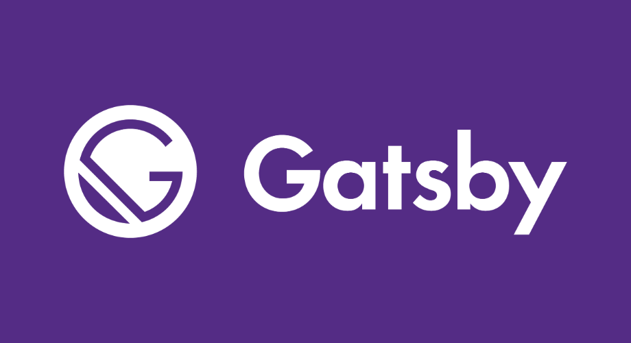

# Why you should use Gatsby to build your landing page
Have an awesome landing page it's essential for your business, allows your potential clients to know about what problem do you resolve for them and it's the visible face of your company. For that you need your page loads as fast as possible, all the major search engines such as Google, Bing, and Yahoo have it primary in search results and make available for everyone. And **Gatsby takes care of that and much more for you.**

## What is Gatsby?
Gatsby is a free and open-source framework based on React that helps developers build blazing fast **websites** and  **apps**, or that is what they say on your website, for me Gatsby is more than other framework based on React, it's the way to build your website right from the start and solve all the classical problems made pages at the first line of code. Also, there is an amazing community behind them, contribute to make better and better Gatsby and create wonderful plugins that resolve all types of problems that enable integration with just a couple of code lines.

## What Gatsby resolves?
Gatsby resolves a lot of things, for example, offline support, integration with WordPress, lazy loading of images and much more. But specifically, if you need to build a landing page as soon as possible, the following features stand out with Gatsby:

### SEO (Search engine optimization)
SEO is vital for your landing page, allows to your website shows on the search engine what is translated in more views. With Gatsby, much of this problem is resolved as long as Gatsby generates static pages, which means the crawler of the search engine will take all the information of your page without loading the Javascript of your site, but there are other things we can do for improve this. We can add the plugin `react-helmet` for Gatsby because this is important not just for site viewers, but also for SEO — title and description metadata stored in the document head is a key component used by Google in determining placement in search results. You can see the SEO performance of your page with [Lighthouse](https://developers.google.com/web/tools/lighthouse) tools on Chrome.

###  Progressive Web App
Gatsby.js is a generator of Progressive web apps, this is a great improvement to your landing page because loads only the critical HTML, CSS, Javascript and data that you page need to show, also Gatsby prefetches resources for other pages, so if you hover your mouse on a link, Gatsby preloads the page to provide a fasts load. This is impacts the way your users perceive the speed of your website.

###  Hosting advantages respect to traditional hosting services
One of the most amazing pros of using Gatsby it's not in Gatsby itself, it's in the services related to the deploying of Gatsby page, such as [Netlify](https://www.gatsbyjs.org/docs/deploying-to-netlify/) and [Zeit](https://zeit.co/). These **Static Hosting services** are characterized by having lower prices(free plan have all you need generally) and let you improve your project with continuous deployment, the latter allows you have a faster deployment to your page and test changes before you push to production.

### Extreme easy blog integration
Say goodbye to cumbersome olds CRM blogs, the integration, and creation with blog are extremely easy, you can start with a [*starter*]([https://www.gatsbyjs.org/starters/gatsbyjs/gatsby-starter-blog/](https://www.gatsbyjs.org/starters/gatsbyjs/gatsby-starter-blog/)) provided by gatsby or you can integrate with your landing page, there are great [examples]([https://github.com/wp-graphql/gatsby-wpgraphql-blog-example](https://github.com/wp-graphql/gatsby-wpgraphql-blog-example)) of blogs made by the community so is only search, and with continues deployment you can forgot about deploy every time you can create a blog post.

## Conclusion
Pick the right tool for the job is essential when you start a project, for that and much more, Gatsby adapts perfectly, make the development much faster and easier, to the creation of static pages such as your blog or your landing page.