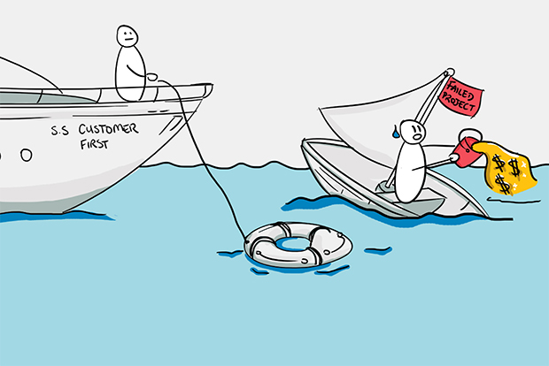

# Your idea is only a rounding error

## We know you love your idea

As a tech services company, we see lots of clients who are in love with their idea. They try to protect it from disclosure with NDAs or by revealing only partial information about it to us. I'll always remember when a prospective client in New York City made me manually sign an NDA before he would have breakfast with me. He didn't trust electronic NDAs.

## NDAs loopholes

In court, NDAs usually aren't worth the paper (or PDF) they're printed on. That's because ideas usually aren't unique. The world is full of ideas. If you have one, about a million people probably have almost the exact same idea. About 50,000 people might have tried to execute it to some degree. About 5,000 people might have made an organized effort at developing it. And about 300 or 400 people might already have some results from a variation of your idea. It's hard to prove in court that someone stole your idea if many people already use it.

## What really grows your business

**Ideas are such a small part of a working business that they can be considered a rounding error.**
 
So don't fall in love with ideas, and don't confuse your attachment to a single idea with passion or drive. A successful business is made up of more than just a few good ideas. The full picture includes your network of contacts and potential customers and the problems you're trying to solve. Be realistic about your chances to raise money, execute your projects, and assemble a team.

These elements are far more important than any one idea you might have:

- Self-awareness - know your strengths and weaknesses
- Technical skills
- Business acumen
- Domain knowledge
- Adaptability
- Internal and external communication
- Public image

## Fear of partnering

We understand how it feels to come up with an idea that you think is the best thing in the entire world. That happens to us too. But the rosy glow you feel can be deceiving. We're not saying that your idea doesn't have value, or that it won't be helpful to your business. But most digital service companies won't be as excited about it as you are. They certainly won't be excited enough to steal it, especially when the consequences of doing that would destroy their own business.

##Get real, get feedback

Don't hide your idea, share it. Tell your friends, family, coworkers, mentors, and colleagues all about it. You might get some interesting feedback that you can digest and consider. Is it as good as you thought, or does it have some weaknesses you didn't notice? Is it even better than you thought? Getting input about your idea can only make it better. That includes input from your service provider, whose job is to understand exactly what you want, adjust your idea to make it technically sound, and then implement it if it's feasible.

## How ideas become reality

Executing an idea requires a level of effort and focus that no service company can ever achieve without your collaboration. Top-quality tech services co-create your product with you. Make sure to find the right service partner, one that embraces the agile process. Agile development is the gold standard for today's cutting-edge technology, so don't accept a partner who offers anything less.

## Beware of sunk cost fallacy

An example of sunk cost fallacy is still putting money into developing a rigid definition of your idea even when you know it's not going to work. That money is gone, and you can't get it back by wasting more money. If your idea doesn't work, look at it from another angle, learn from it, make changes, and try again. If it's clear that it's never going to work, leave it. You learn a lot from that anyway. Together with your tech team, you learn what won't work, and you increase your understanding of your functional business platform. Understanding what won't work is how you learn what will work.

Lower your chances of wasting money on an idea that isn't going to work by being completely transparent about it with your service provider. A good tech team has the knowledge to spot potential blocks and issues from the beginning, but they can't do that if you hold anything back. Share a full understanding of your business, your existing platform, and all the details about your idea. Then your team can use their knowledge and expertise to define a process to create a successful product.

## Control your emotions and Ego

We've all been bombarded with overnight success stories: how Instagram had to scale, how Facebook started in Mark Zukerberg's bedroom running on an Apache Server, and so on. Of course, anything is possible, but these are exceptions, not the rule. If you want to play soccer, chances are that you won't become Lionel Messi.

To maximize your own chances of success, keep a level head and know your business, learn everything that can be learned about it, meet people, and solve a real problem. Maybe, just maybe, your solution to the problem will be something new and valuable. If that happens, your solution can turn into a real and lucrative business.

## The bottom line

- Release any emotional attachments that might cloud your sound reasoning about your ideas.
Don't fall in love with your ideas. You need to be able to let them go when that's the best business decision.
- Focus your passion on solving problems and making your customers happy.
- Don't keep your idea all to yourself. Share it and ask others to challenge it.
- Find a service partner who will co-create a product with you, with the right skills, processes, and strategy.
- Don't waste your time and money on partners who cut corners or don't follow the agile process.
- Don't skimp on collaboration, knowledgeable experts, and following the steps of a well-designed process to save money. Taking the cheap route can cost you more money in the long run when your system has issues that impact your business operations.

If you'd like to contact me, feel free to reach me out at anthony@rootstrap.com.