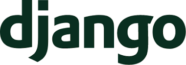

# Django vs Flask: which one should you choose for your project?
Django and Flask are among the most popular Python web frameworks.
In this article we're going to review their main strengths and weaknesses to help you decide which one is the better fit for your project.

# Django

## Approach
Django opts for an all batteries included approach.
From a powerful ORM to an authentication system or a templating engine, Django takes care of it all without the need to learn any extra libraries.

It also has the concept of pluggable apps, that means that you can drop an app folder inside your project and get its functionality right away
with very little configuration.

## Main features
- Django has a very powerful ORM that exposes a lot of SQL to the python programming language.
- Authentication and Authorization built in, without any extra configuration.
- A built in admin site.
- A built in mailing system.

## Pitfalls
- Tightly coupled with its toolset, Django is sort of difficult to use in combination with other tools (replacing the form library for example).
- The default scaffolding, while not bad for small projects, does not scale without modification when trying to manage things such as multiple environments.
- It implements the Model View Template pattern, and requires some effort to implement other architecture types with it.

## Developer experience
One of the perks of using an all batteries included approach is that the developer experience will be more or less the same across the framework.
This proves very friendly to people new to the framework, that can follow a pattern and be guided to follow good practices by looking at existing code.
The other gain you get from this is that core parts of every site would be tried an tested.
This is a very desirable feature for some parts like authentication and authorization, or an admin panel for providing easy backoffice access to your team.

## Team size and structure
Django is at its best for a small to medim team that plans to handle a middle to large sized codebase
The project structure takes that into account and file conflicts will be minimal.
Since it has sort of a scaffolded default structure for it's projects is very easy to ramp up newbie developers into it with a senior supervising the team.

# Flask

## Approach
Born as a combination of an http server with a template engine zipped together, Flask opts for a very minimalistic approach.
It provides some minimal structure, but leaves the decisions up to you.
This makes flask very easy to extend with practically whatever you want.

## Main features
- Very lightweight.
- It requires little to no configuration.
- Not opinionated, you have total freedom to decide the project structure, from a single file to an elaborate folder system.
- When you need some structure, you have blueprints to structure your app.
- Easy to integrate with other python libraries.

## Pitfalls
- Since it's very lightweight, while the framework itself doesn't need any special configuration, the used libraries often do require config.
- You have to mix and match libraries to get the desired functionality. This also means that different parts of your project have different support from the community.
- The lack of opinion can lead to complicated architectures, or to very big single file projects.

## Developer experience
Flask is what you want it to be.
But it makes you work for it, you can start importing any libraries you like and code your app your own way.
This can be really cool, and makes a lot of sense if you want to quickly spin up a quick api for puting your python code on the web.
On the other side, the lack of guidance can be a bit overwhelming for a new user, that can be a bit lost if it does not know exactly how the framework works
Also, if you want some standard features, like Authorization and Authentication or an admin panel, you will have to search for thrid party libraries or roll your own implementations.
This can be a bit repetitive since almost every application has these kind of features implemented to a certain extent

# Team size and structure
The liberties that flask gives you require a lot of experience to take advantage of.
The initial simplicity of a sigle file app can lead very easily to a very big single file app.
This is not bad if you just want to prototype something, but when you sart to split the app into files you will have the entire responsibility of those architecture decisions.
Flask is better suited for very small codebases that do one thing and do it well, maintained by small teams.
If you plan to spin up a lot of microservices for example, this can be a good fit.

# Wrapping up

## Django is a good idea for…
- Quickly validating business ideas.
- Ecommerce sites with standard features.
- Information systems in general where reporting is important.
- Medium or Large codebases with small or medium teams maintaining them.

## Flask is a good idea for…
- Lightweight applications.
- Microservices.
- Non MVT or MVC projects.
- Small codebases and small teams maintaining them.

# So... Which one should I choose?
To properly answer this question you need to take into consideration all the project requirements and make a decision based on that.
If development speed is the most important thing because you need to go to the market fast, then Django probably will be the better choice,
since you get a more complete feature set out of the box.
If you need a more custom solution, or your project features are out of the ordinary Flask might be the better choice.
At the end of the day, you should choose the framework that adjusts more into your project idea and particular situation,
taking into consideration their strengths and weaknesess, not only code wise but also if the coding style that their propose it's adecuate to your organization.

Do you have any experience that you want to share with any of this frameworks?
Are there any extra pros or cons that you feel are missing?
If you do I invite you to discuss them in the comment section.

Thanks for reading.
 
