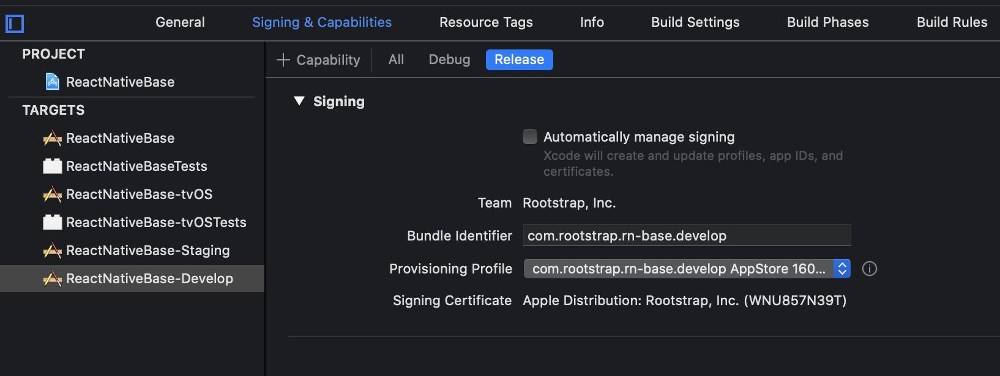
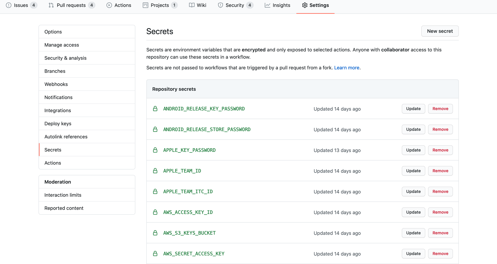
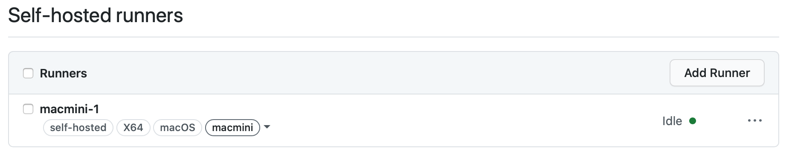

# **Automating iOS App Builds with Fastlane and GitHub Actions**

*This is part 1 of a two-part post on mobile app automation. Next chapter will focus on Android build automation*

Mobile app development is one of our core competencies here at Rootstrap, and we embrace best practices for development and delivery just as much as for backend and web applications. As Continuous Integration/Continuos Delivery requires maintaining multiple backend environments (Development, QA, Staging, Production), with fully automated deployments to each, it also requires maintaining multiple versions of our mobile apps, to match each environment. Building and releasing all these versions is a time consuming and error prone process, which should -and can be automated, even though it presents a particular set of challenges.

In this post I am going to describe the approach we implemented for iOS CI/CD making use of Fastlane, a CI system (GitHub Actions), and some spare MacMinis which were sitting idle in the office and got turned into build servers. I will also use AWS S3 to store signing artifacts, but any system where we could safely store encrypted files could serve.

For this example we will use an iOS app developed with React Native, but the same approach works when developing natively for iOS -and as we will see in the follow-up article, it can also be translated to Android apps.
Using local machines is not absolutely required, but it is useful for iOS.

## Why Fastlane

[Fastlane](https://docs.fastlane.tools/) touts itself as the easiest way to automate deployments for mobile apps. If offers integrations with other CLI tools and APIs including Xcode, Android SDK, Gradle, iTunes App Store, Google Play Store, Git, AWS S3, etc. We adopted it because we found it to be:
* Easy to setup (just install a Ruby gem)
* Flexible, with an easy to read syntax (most commands have self-descriptive alias)
* Open Source and free to use
* Widely adopted and well maintained (accquired by Google in 2017)
* Easy to integrate with CI systems (though 2FA authentication presents challenges as we'll see)

## Why GitHub Actions

GitHub offers [Actions](https://github.com/features/actions) as a complete CI/CD system that seamlessly integrates with repositories hosted there. 
Our experience showed it to be:
* Easy to write and read, with a straightforward YAML syntax
* Flexible, offering hosted runners in every major OS and integrations with pretty much every major tech stack and hosting platform
* Cheap -considering it is free for Open Source projects and when using self-hosted runners (this is where our spare MacMinis become valuable)

## Prep work

### Application Targets

Within our Xcode project we would define multiple iOS [build targets](https://developer.apple.com/library/archive/documentation/ToolsLanguages/Conceptual/Xcode_Overview/WorkingwithTargets.html) with build settings corresponding to each target environment. Each of these will need to be associated to an app bundle ID created in the Developer Portal, and listed in the [iTunes Connect site](https://itunesconnect.apple.com/).

We should [disable Xcode automatic signing](https://help.apple.com/xcode/mac/current/#/dev1bf96f17e) for the targets we want to handle with Fastlane and associate the corresponding Provisioning Profile. This configuration should be checked into our repo to be picked by the CI system (we can always override them to use automatic signing locally).

### Codesigning 

We know that for an iOS app to be distributed, it needs to be signed with a certificate issued by Apple and a provisioning profile allowing to install or distribute the application with such certificate. So after registering these apps we will need:
  - A Distribution Certificate (.cer) and private key (.p12) (https://calvium.com/how-to-make-a-p12-file/)
  - A Provisioning Profile for Appstore distribution tied to app bundle ID and cert

We can store the password for the .p12 file in [GitHub Secrets](https://docs.github.com/en/actions/configuring-and-managing-workflows/creating-and-storing-encrypted-secrets) and make it available to the workflow as an environment variable when importing it.

All three files should be uploaded to a secure location that our CI process will have access to. 
Fastlane suggests using [match](https://docs.fastlane.tools/actions/match/) for this, which is a pretty good solution but has some limitations:
* It only works for iOS
* It cannot be extended to cover other sensitive files our build might need
* It requires access to a specific GitHub repo for each project, which involves some extra steps when running from a CI/CD server

So the solution we are trying here makes use of [Amazon S3](https://aws.amazon.com/s3/). This works well for us as we typically use S3 in all our projects (Frontend and Backend) and normally have  AWS credentials in our working environment. One single *private* bucket, encrypted with [AWS KMS](https://docs.aws.amazon.com/AmazonS3/latest/dev/UsingKMSEncryption.html) allows us to securely handle our Certificates, Keystores and other sensitive files for all our projects. It is a good practice to create a specific user for our CI workflow which only has access to proper bucket and path. You can read about Access Management for S3 [here](https://docs.aws.amazon.com/AmazonS3/latest/dev/s3-access-control.html)

Our workflow thus only needs to include environment variables with valid AWS keys, which should be also stored as repo Secrets.
* `AWS_ACCESS_KEY_ID`
* `AWS_SECRET_ACCESS_KEY` 

### Apple ID 

In order to authenticate to App Store Connect Fastlane recommends using a dedicated Apple ID that doesn't have 2FA enable and is not an Account Holder. However it is currently not possible to create a new Apple ID without 2FA (and old accounts cannot remove it once enabled). 
This means when it needs to authenticate to the App Store from a new machine, Fastlane will prompt for a security code which will be sent to a trusted device. There are two possible workarounds for this when running on CI systems, both with significant limitations:
* Apple application-specific passwords (only good for uploading binaries) available in the environment variable `FASTLANE_APPLE_APPLICATION_SPECIFIC_PASSWORD`.
* Generating a temporary Apple login session and storing in `FASTLANE_SESSION` variable. This can be done using Fastlane's `spaceauth`. It is however restricted not only in duration (one month), but also geographically (cannot be used on a different region from where it is generated).

For use of our CI workflow we will manually log into the shared Apple ID from our build servers, associating them as trusted devices.

The following environment variables will need to be present in our workflow, so we should store their values as repo Secrets:
* `FASTLANE_USER`                               : Apple ID used for submission
* `FASTLANE_PASSWORD`                           : Password for this ID 
* `FASTLANE_APPLE_APPLICATION_SPECIFIC_PASSWORD`: Application-specific password
* `FASTLANE_ITC_TEAM_ID`                        : iTunes Connect Team ID to submit under

See [Fastlane docs on Apple Authentication](https://docs.fastlane.tools/best-practices/continuous-integration/) for more info and options.

### Other environment variables and files

For a React Native project we would typically have a `.env` file including multiple environment-specific variables, including but not limited to the backend URL that each version of our app should target. Likewise for an iOS-native project we could have `.xcconfig` files including environment-specific params, several of which could be sensitive. There are several ways to securely handle and process these items, but in our example we will store all the relevant parameters as repo Secrets and read them as environment variables in our workflow in order to build this `.env` file at runtime. So for instance our DEV workflow would have a `API_URL` environment variable pointed to the `DEV_API_URL` repo Secret.

## The Fastfile

### Environment settings
The required input parameters could be hardcoded here but it is preferable to read them from environment vars due to:
- Security (we will want to retrieve anything that could be sensitive from the repo Secrets)
- Maintainability (by setting some parameters dynamically we can use the same code for multiple targets)
https://gist.github.com/sebalopez/9dd6da87127f1f789b81a583df250485

### Sign and Build steps
The `prepare_keychain` lane will:
* Create a temporary keychain
* Import the Certificate and associated Private key from the local filesystem into the keychain 

This lane is optional (we might not need it when running Fastlane on a machine where the right certificates are already installed)

The `build_and_sign` lane will:
* Run cocoapods to install pod dependencies
* Run xcodebuild against the desired scheme (passed as input param) to generate the .ipa file
* Delete the temporary keychain (to avoid potential conflicts with future runs)

https://gist.github.com/sebalopez/963af49f3636ead8c16c607f8c70f031

### Publish steps
The `publish_appstore` lane will:
* Generate a changelog from the git log
* Authenticate to iTunes Connect and upload the .ipa file to TestFlight with associated metadata
* Retrieve the current build number for using in notification
* Send a notification to the specified Slack channel informing that the build was successful and has been submitted (this is set to not fail the entire build if webhook configuration is not valid)

https://gist.github.com/sebalopez/94806272e5d0018671dd2c572f233f7e

Alternatively we could have lanes for AdHoc distribution that send the .ipa elsewhere (such as S3).

### Release targets
The lanes we will invoke externally make use of the above lanes to build and release the specified target.
* Before building we run `ensure_git_status_clean` to make sure we are not including code that is not checked into the repo
* The input parameters for the sign_and_build lane will be the scheme and desired export method ('app-store' or 'ad-hoc') which need to match the Provisioning Profile we have selected for the target.
* Before publishing to an App Store we can run additional steps such as tagging the release and committing the tag on the appropiate branch -see [add_git_tag](https://docs.fastlane.tools/actions/add_git_tag/) to adapt params as needed.
* The input parameters for the publish_appstore lane will be the scheme -which corresponds to a registered app in the App Store.

https://gist.github.com/sebalopez/bb5abf86521cfa9f1d07c483fce0baa5

## The GitHub Actions Workflow

Now that we have our Fastlane configuration, we can validate it by running locally. But we want to set this up so it runs automatically whenever we push to the right branches, and we do not want to tie up our development machine's resources while this process runs. This is where GitHub Actions comes in.
The GitHub workflow file is checked into `.github\workflows\dev_build.yml` and performs the following steps:
* Setup the required version of Node and install Node dependencies (for a React Native project)
* Download the codesigning elements from S3 (certificate, private key, provisioning profile)
* Generate the environment configuration file from values in Secrets
* Call Fastlane to build and publish the app
https://gist.github.com/sebalopez/79c96e4734c208ed7a091c8e174d1f4c

## Setting up a local build server

As mentioned before, the previous workflow could run on any GitHub macos runner, but it would likely get stuck when attempting to log into TestFlight due to a 2FA token prompt. The workaround 
we implemented is using any Mac we have physical access to as a self-hosted runner. 
For this we need to perform two simple steps:

* Associate the device with the Apple ID used for submission, by logging into https://appleid.apple.com/ and entering the 2FA token from the device.

* Setup the GH agent by following GitHub's guide for [self-hosted runners](https://docs.github.com/en/actions/hosting-your-own-runners).
  * Organization owners can add self-hosted runners shared by multiple repos in an organization (keeping in mind job concurrency limits).
  * Otherwise repo owners need to repeat the process of adding it individually for each repo (the same actual machine can still be reused for multiple projects).

Fortunately there is no need to do any project-specific setup beyond this, as we can let GHA handle the build requirements (official and third-party Actions are available to self-hosted runners). We also do not need to give the machine a public IP address, as the agent installed during the setup will poll GH for kicking off the workflows and reporting back.

Upon setting up the runner, we can associate our workflows with it just by specifying its label in the `on:` section.

Some important configuration items:
* [Set the Mac to never enter sleep mode ](https://support.apple.com/guide/mac-help/set-sleep-and-wake-times-mchle41a6ccd/mac)
* [Configure the runner application as a service](https://docs.github.com/en/actions/hosting-your-own-runners/configuring-the-self-hosted-runner-application-as-a-service) so it automatically starts upon a machine restart

## Summary

We have gone through an example of Fastlane as a powerful free tool for automating our mobile app build and release processes, and GitHub Actions as a good CICD system that can integrate with Fastlane to trigger our pipelines automatically and in a secure environment. We have also see an easy way for turning our spare Macs into build servers. 

You can find complete working examples in our Open Source boilerplate projects, [iOS Base](https://github.com/rootstrap/ios-base) and [React Native Base](https://github.com/rootstrap/react-native-base). 

All these cover just a couple of the many use cases you can apply these tools for -we highly recommend you to go through their extensive documentation sites. 

Stay tuned for the follow-up article, where we build a similar workflow for an Android project!