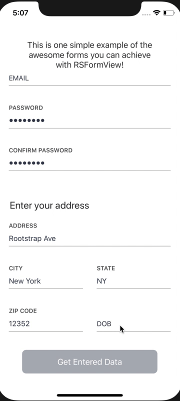

# Quickly Implementing elegant forms with RSFormView in Swift
*[Germán Stábile](https://www.rootstrap.com/tech-blog/) is an iOS developer on the Rootstrap team and recently has started to write about some of the challenges faced during iOS development. You can also follow Germán on [LinkedIn](https://www.linkedin.com/in/german-stabile-61a1b755/).*

Note: this post is meant to discuss motivations and implementation of RSFormView, if you are interested in a tutorial on how to integrate please visit [RSFormView Readme](https://github.com/rootstrap/RSFormView) or the next article [Link to next article].

## Introduction 

During my first experience with React-Native for a short, form-based project, I found extremely useful the [redux-form](https://github.com/erikras/redux-form)  library and kept thinking on how nice would it be to have such library for iOS development. After finishing that project it was time to move back to iOS native programming for another project (yay!).
A few glances at the beutiful wireframes the design team provided and I see at least five forms for data entry: and so I thought, developing a form component with such beautiful design (by default) may be both useful and fun! 

In my time as an iOS developer I have seen and work with a bunch of different form implementations, some repeating too much code and the ones with a more componetized solution were buggy or too difficult to extend or accomplish the design intended. 

I wanted to avoid these issues and implement something we could use in different projects but giving the time constraints I knew I couldn't build something as configurable as [redux-form](https://github.com/erikras/redux-form).

However with the beautiful design I was handed and making fonts, colors, and margins configurable it should be enough given that we can extend as we need more functionalities and maybe some day making it fully customizable. 

Development on that project was very smooth having implemented this component before hand. I was able to finish any form based screen in a few minutes and with very few lines of code. Seeing how happy I was with the results I decided to use the extra time in my hands and share the goods with the open source community.    

## What Is RSFormView?

[RSFormView](https://github.com/rootstrap/RSFormView) is a library that allows you to create data entry forms in a few minutes with beautiful out of the box  design that you can also configure setting your custom colors, fonts and margins. 

### What can it do? 

- It supports different out of the box data entry options: regular text fields, password text fields, date pickers, options pickers, etc.
- It provides default validation for each text field type. Default validation can be overriden with any of the out of the box validation types or your custom validation.
- It allows easy configuration: you can choose if you want the formView to be scrollable or not and choose your own fonts, colors and margins for each text field state (editing, valid and invalid).
- The FormView makes a callback to its delegate whenever a change is made, so there you can update any view dependant on the data entered. (For example  enable/disable a submit button).
- You can easily collect the entered data by iterating the items array of your FormViewModel.
- Ability to manually mark items invalid, useful when you have backend validation. 
- Ability to use TextFieldView (component inserted to FormViewCells) with no need of a FormView. 
- Out of the box dark mode configuration you can set with a single line of code.
- Ability to perform matching validation: useful for password/confirm password fields.  

### What needs to be improved? 

- Adding your own custom views as text fields in order to make the form view fully customizable. 
- Adding more out of the box field types (we are planning to do this gradually as we identfy more needs).
- Better support long error messages.
- Support Carthage.

## How it is implemented?

FormView is a custom view with a single UITableView embedded. 
The table view is populated with three type of cells (for now): TextFieldCell, TwoTextFieldsCell, FormTextCell. 

What type of cell is going to be displayed is determined by your implementation of the FormViewModel protocol.
A FormItem with a single FormField will be rendered as TextFieldCell.
If it has two FormFields it will be rendered as a TwoTextFieldsCell. 
If it was created with no FormFields and with an NSAttributedString it will be render as FormTextCell you can use as a header, beside the NSAttributedString attributes you can further customize it by setting a ConstraintsConfigurator. 

TextFieldView is going to update its state according to the text entered and the validation you have set in the related FormField, validations will be done real time (as the user types).
The delegate will be notified every time an entry is made, so you can update any dependant view as needed. 

See RSFormView Readme for usage examples and guidance: https://github.com/rootstrap/RSFormView.
In that repo you'll also find an example app using RSFormView.
Feel free to leave your feedback and request improvements or additions by creating issues. 

If you're interested in a tutorial showcasing some of the functionalities continue reading: [Link to next article].

Thanks so much for reading! I hope you find the library useful! 

