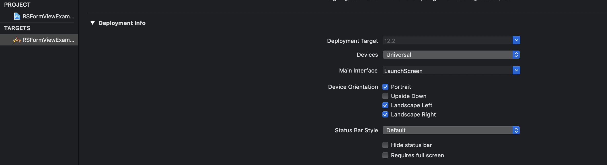
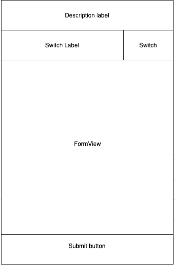
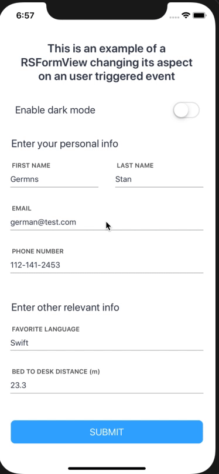
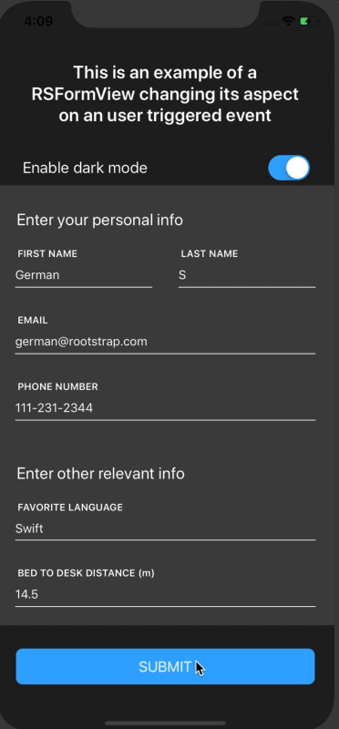

# Build an app with RSFormView in Swift
*[Germán Stábile](https://www.rootstrap.com/tech-blog/) is an iOS developer on the Rootstrap team. He writes about the challenges faced in iOS development. You can follow Germán on [LinkedIn](https://www.linkedin.com/in/german-stabile-61a1b755/).*

Note: This blog helps you integrate RSFormView into your app. For more about the motivation and implementation of RSFormView see the previous article [Link to previous article].

## Create an Xcode project   

 In this tutorial, we implement a single-view iOS application with RSFormView, step-by-step. To get started, create a new Xcode project and select Single View Application. 
 Choose a name and a destination for the project, in this case, RSFormViewExample.
 
 ### Install CocoaPods and RSFormView

  1. To integrate RSFormView, first, install Cocoapods and add a Podfile in your project folder.
        Instructions can be found in the CocoaPods [guides](https://guides.cocoapods.org/using/using-cocoapods.html).
        
  2. To bring the latest RSFormView version add `pod RSFormView` to your Podfile, move to the project folder in the Terminal and run `pod install/update`.
  
  3. After RSFormView installs, open the workspace you'll now see in your project folder.

### Create your first view controller

Xcode creates a `Main.storyboard` by default, and a `ViewController.swift` class. 
Because we will integrate RSFormView programmatically, you can remove `Main.storyboard` and under Deployment Info in your target General tab, select "LaunchScreen" as the Main Interface. To integrate RSFormView in a storyboard-based application, see this [README](https://github.com/rootstrap/RSFormView).



Now rename `ViewController.swift` to something more descriptive, like: `FormViewExampleViewController.swift` 
and write `application(didFinishLaunchingWithOptions:)` in  `AppDelegate.swift`:

``` swift
  let navigationController = UINavigationController(rootViewController: FormViewExampleViewController())
  navigationController.setNavigationBarHidden(true, animated: false)
  window?.rootViewController = navigationController
  return true
```
In this code block, we set a `UINavigationController` with our initial view controller as the root. We hid the navigation and set it as our `window`'s `rootViewController`.

If you run the app now it displays a white screen. So let's add some content to the view controller. 

### Manage your view controller's layout  

To access RSFormView module, add `import RSFormView` at the top of the fule.

Then add properties for the UI components:

``` swift
//MARK: UIComponents
var formView = FormView()
var submitButton = UIButton(type: .custom)
var descriptionLabel = UILabel()
var switchLabel = UILabel()
var modeSwitch = UISwitch()
```

You may be wondering what are all these UI components for?

We are gonna be building a view controller with a description label on top. 
Under that, we'll set a label  with an UISwitch next to it, that enables or disables a fancy "dark mode".
Our FormView sits right under the label and UISwitch. The submit button will be at the bottom of the screen right under the form view. 

Our view controller will look like this:



### Configure Views

Now, let's start coding. First, override `viewDidLoad`, and call `super`. Then call `configureViews`, which is where we'll do the actual layout:

``` swift
func configureViews() {
  view.backgroundColor = UIColor.white
  configureFormView()
  configureLabels()
  configureSubmitButton()
  configureSwitch()
  configureConstraints()
}
```

This function configures every UIComponent in this view controller. To make it more readable, we break into separate functions. 
The naming should be self-explanatory here, and each configure function should be pretty straightforward except for  `configureConstraints` were all the autolayout magic happens.

``` swift
func configureSubmitButton() {
  updateSubmitButton(enabled: false)
  submitButton.layer.cornerRadius = 8
  submitButton.setTitle("SUBMIT", for: .normal)
  submitButton.setTitleColor(UIColor.white, for: .normal)
  submitButton.translatesAutoresizingMaskIntoConstraints = false
  submitButton.addTarget(self, action: #selector(submitButtonTapped), for: .touchUpInside)

  view.addSubview(submitButton)
}

func configureLabels() {
  descriptionLabel.numberOfLines = 0
  descriptionLabel.lineBreakMode = .byWordWrapping
  descriptionLabel.translatesAutoresizingMaskIntoConstraints = false
  descriptionLabel.textColor = UIColor.brightGray
  descriptionLabel.textAlignment = .center
  descriptionLabel.text = "This is an example of a RSFormView changing its aspect on an user triggered event"
  descriptionLabel.font = UIFont.systemFont(ofSize: 22, weight: .semibold)

  view.addSubview(descriptionLabel)

  switchLabel.textColor = UIColor.brightGray
  switchLabel.textAlignment = .left
  switchLabel.translatesAutoresizingMaskIntoConstraints = false
  switchLabel.text = "Enable dark mode"
  switchLabel.font = UIFont.systemFont(ofSize: 19)

  view.addSubview(switchLabel)
}

func configureSwitch() {
  modeSwitch.isOn = false
  modeSwitch.onTintColor = UIColor.dodgerBlue
  modeSwitch.translatesAutoresizingMaskIntoConstraints = false
  modeSwitch.addTarget(self, action: #selector(switchValueChanged), for: .valueChanged)

  view.addSubview(modeSwitch)
}
```

Except for the `formView`, which we leave for the end, the functions in the preceding code block, set these initial states for each UI component:
   • Titles and background colors for labels and buttons.
   • Actions for the submit button and the `modeSwitch`.
   • `translateAutoresizingMaskIntoConstraints` set to false for every UI component, because we'll be writing the constraint in `configureConstraints`.

Finally, we add the views to the view controller's view. 
You see compiler errors when setting submitButton and modeSwitch targets because the referenced selectors aren't defined yet, ignore those for now. 

Now let's configure `formView`: 

``` swift
func configureFormView() {
  formView.delegate = self
  formView.viewModel = formHelper
  formView.translatesAutoresizingMaskIntoConstraints = false

  view.addSubview(formView)
}
```

You see two compiler errors in this function because your view controller doesn't comply with `FormViewModel` delegate, and  `formHelper` isn't defined yet. 
We'll do that in the next section. 

Now let's tackle  `configureConstraints`. It sets all the layout rules for every view in our view controller:

``` swift
func configureConstraints() {
  let horizontalMargins: CGFloat = 32
  let verticalMargins: CGFloat = 10
  let submitButtonMargins: CGFloat = 24

  NSLayoutConstraint.activate([
    descriptionLabel.topAnchor.constraint(equalTo: view.safeAreaLayoutGuide.topAnchor, constant: verticalMargins * 3),
    descriptionLabel.leadingAnchor.constraint(equalTo: view.leadingAnchor, constant: horizontalMargins),
    descriptionLabel.trailingAnchor.constraint(equalTo: view.trailingAnchor, constant: -horizontalMargins),
    descriptionLabel.bottomAnchor.constraint(equalTo: switchLabel.topAnchor, constant: -verticalMargins * 4),

    switchLabel.leadingAnchor.constraint(equalTo: view.leadingAnchor, constant: horizontalMargins),
    switchLabel.trailingAnchor.constraint(equalTo: modeSwitch.leadingAnchor, constant: horizontalMargins),
    switchLabel.bottomAnchor.constraint(equalTo: formView.topAnchor, constant: -verticalMargins),

    modeSwitch.widthAnchor.constraint(equalToConstant: 49),
    modeSwitch.trailingAnchor.constraint(equalTo: view.trailingAnchor, constant: -horizontalMargins),
    modeSwitch.centerYAnchor.constraint(equalTo: switchLabel.centerYAnchor),

    formView.leadingAnchor.constraint(equalTo: view.leadingAnchor),
    formView.trailingAnchor.constraint(equalTo: view.trailingAnchor),
    formView.bottomAnchor.constraint(equalTo: submitButton.topAnchor, constant: -verticalMargins),

    submitButton.leadingAnchor.constraint(equalTo: view.leadingAnchor, constant: submitButtonMargins),
    submitButton.trailingAnchor.constraint(equalTo: view.trailingAnchor, constant: -submitButtonMargins),
    submitButton.bottomAnchor.constraint(equalTo: view.safeAreaLayoutGuide.bottomAnchor, constant: -submitButtonMargins),
    submitButton.heightAnchor.constraint(equalToConstant: 44)
])
}
```

To create the design we want, we set constraints to attach our views to each other.


## Populate the form view

### Form view delegate

First, we conform to the  `FormViewModel` delegate. 
To keep concerns separated we implement delegates in an extension of the implementing class.
Add this code outside of the scope of the `FormViewExampleViewController`:

``` swift
extension FormViewExampleViewController: FormViewDelegate {
  func didUpdateFields(in formView: FormView, allFieldsValid: Bool) {
    updateSubmitButton(enabled: allFieldsValid)
  }
}
```

This delegate method is called each time a user enters or selects a new value. It let us know if all the fields are complete and the values are valid with the `allFieldsValid` parameter.

### Submit button

Next we update the submit button with this function: 

``` swift 
func updateSubmitButton(enabled: Bool) {
  let backgroundColor = enabled ? UIColor.dodgerBlue : UIColor.brightGray.withAlphaComponent(0.4)
  submitButton.backgroundColor = backgroundColor
  submitButton.isUserInteractionEnabled = enabled
}
```

### Form view model

When we set an RSFormView `viewModel`, we are telling the RSFormView that this object will populate it.
This object needs to conform to `FormViewModel` protocol in order to do so, which requires it to hold an items array of `FormItem`s.

Now let's create a file to implement the `FormViewModel` protocol. Using `ExampleFormHelper` as a name. 
For simplicity I'm only adding a few items in this code block:

``` swift
import RSFormView

class ExampleFormHelper: FormViewModel {

var items: [FormItem] = []

lazy var nameItem: FormItem = {
  let firstNameField = FormField(name: "FIRST NAME",
                                 initialValue: "",
                                 placeholder: "FIRST NAME",
                                 fieldType: .regular,
                                 isValid: false,
                                 errorMessage: "First name can't be empty")
  let lastNameField = FormField(name: "LAST NAME",
                                initialValue: "",
                                placeholder: "LAST NAME",
                                fieldType: .regular,
                                isValid: false,
                                errorMessage: "Last name can't be empty")

  return TwoTextFieldCellItem(firstField: firstNameField, secondField: lastNameField)
}()

lazy var personalInfoHeaderItem: FormItem = {
  let headerItem = TextCellItem()
  headerItem.attributedText = NSAttributedString(string: "Enter your personal info",
                                                 attributes: [.foregroundColor: UIColor.brightGray,
                                                              .font: UIFont.systemFont(ofSize: 20)])
  return headerItem
}()

func init() {
  items = [nameItem, personalInfoHeaderItem]
}
```

For a look at the whole implementation, you can download the example project attached at the end of this article.  
Since we are setting two FormFields in the first item it will be rendered as a cell with two text fields. 
For the header, we are only setting a `NSAttributedString` so it will be rendered as a single label cell with the appearance we set in the attributes. 

Now let's go back to our `FormExampleViewController` and define a var to hold our form helper. 

``` swift 
var formHelper = ExampleFormHelper()
```

Finally, we define actions for the `submitButton` and `modeSwitch`: 

``` swift
//MASK: Actions
@objc
func switchValueChanged(sender: UISwitch) {
  let isDarkMode = sender.isOn
  let configurator = isDarkMode ? DarkModeConfigurator() : FormConfigurator()
  formHelper.updateHeaders(isDarkMode: isDarkMode)
  formView.formConfigurator = configurator
  view.backgroundColor = isDarkMode ? UIColor.mineShaftGray : UIColor.white
  descriptionLabel.textColor = isDarkMode ? UIColor.white : UIColor.brightGray
  switchLabel.textColor = isDarkMode ? UIColor.white : UIColor.brightGray
}

@objc
func submitButtonTapped() {
  var collectedData = ""
  for field in formHelper.fields() {
    collectedData += "\(field.name): \(field.value) \n"
  }
  let alert = UIAlertController(title: "Collected data",
                                message: collectedData,
                                preferredStyle: .alert)
  alert.addAction(UIAlertAction(title: "OK",
                                style: .cancel))
  present(alert, animated: true)
}
```
`switchValueChanged` changes our views aspect based on the selected value. If set to on set the "dark mode" otherwise we go set the default mode. 
Here we are using the two out of the box configurations for the formView the `DarkModeConfigurator` and the default `FormConfigurator`

In the submit button action, we are iterate through all the fields in the formView and display them in an alert along with the field names. 

Here is the result when switching between modes: 



And here what happens when you tap the submit button:



## Learn more

For the full code base, clone the example app repo [here](https://github.com/rootstrap/RSFormViewExample)

For more about the motivation and implementation of RSFormView see the previous article [Link to previous article].

Thanks for reading! 


