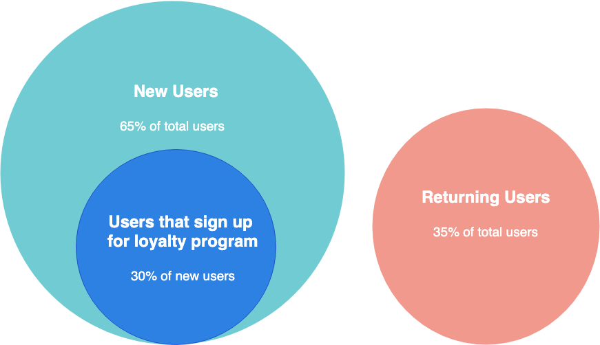

# Load Testing with Apache JMeter.

## Introduction

One of our clients asked us if we can evaluate the performance of their app in a production environment.
So, this task opens several questions that we had to answer:

- How will the current configuration perform in real life?
- Does this configuration scale acording to the client expectations?
- Where are the bottlenecks?
- How should our client scale to solve those bottlenecks?

To achieve the outcome if answering these questions, we've decided that this is a perfect scenario to create and execute load tests.
This article describes what we learned on this journey.

## What is load testing?

Load testing is a type of test that tries to measure an application's performance
under expected user loads.
With this type of test we can measure the users' experience of the app,
collecting metrics about things like response times and error rates.
This info allows us to emulate the day to day experience the clients will have with the app
and plan how to scale the platform as the user base grows.
This also allows us to set an objective criteria about what is acceptable and what is not.

### What is not

This kind of test does not try to cover every bit and every endpoint of our app.
It gives us a general insight of the general user experience under the expected
traffic of the app.
Also, this is not a stress test.

### Load Tests vs Stress Tests

Even tough the testing flow is similar, the mindset for those tests is totally different.
In stress tests we try to load the app to see when it breaks.
Usually those tests cover extreme scenarios that are way more demanding that the usual flow.
Those tests are useful to recreate concrete scenarios like:
- How the telephone network will behave on christmas.
- How our streaming app will perform in the season finale of our most watched series.

Even tough the above scenarios are very real, they do not represent the usual workload of an app
and for that reason they require another type of test.

## Simulation of users: Load Testing
## Reality Model

_¨All models are wrong, but some are useful¨_ - George Box

In this part we have to make some assumptions.
Let's say our client wants to load test an application for a fast food store
where the users can redeem some coupons to get an instant benefit in their lunch
and allows them to register themselves in the application to implement some sort of
loyalty program.

The client tells us that he expects to have 500.000 monthly users by the end of the month.
From that user mass he expects that 65% are anonymus users that redeem coupons occasionally
and the other 35% will be returning users.
We also know that 30% of the users will register in the royality program after the
discount is redeemed.

### Initial Assumptions

Now we have to turn this data into concrete numbers.
With this in mind, we can assume that the application will be used mostly on lunch hours, so
most of the users will concur at that time.
Let's make the following assumptions:
- We're at rush hours of the business.
- 80% of the app uses are made during rush hours.
- 80% of the users are active during rush hours.
- All days have the same user load.
- The client flow is somewhat constant during that hours.

Let's translate this into a simple Venn diagram to vizualize the user groups that we have:

### Doing the math

With that in mind lets do some math:
 - 400,000 is the 80% of 500,000.
 - From that we have two distinct groups:
     - 260,000 new users (65% of all users).
     - 78,000 users that will register in the loyalty program (this is 30% of the new users).
 - 169,000 returning users using the loyalty program.

Now, a month has 30 days and for each day the rush hours are from 11:30 am to 12:30 pm and from 08:30 pm to 09:30 pm.
Then we should adjust our math to see how much user traffic we have in an hour.
Since we have 2 rush hours we should divide every number we have until now between 120 to get how many users
we get per hour on average. 
Take into account that from the total user numbers we're taking the 80% of them since they use the app during the rush hours.
That gives us:

- 5,715 total users.
- 3,715 new users.
    - 1,115 of that new users will register in the app.
- 2,415 returning users.

But we're gonna run our tests during 15 minutes, so we have to divide this numbers again to obtain an approximation of the ammount of users
that will use the app during our tests.
This 15 minutes are known as ramp-up time, what we have to do now is to homogeneously distribute the user input in this period of time.
Even tough there's going to be some concurrent usage of the app, it's not real that all users are going to be using the app
all the time during this period of time.
So what we're going to do is assign every user with a user flow and make that user execute it once in that 15 minute
lapse.
If the start time is random, and all the start times are equally probable, we should get a fairly equal distribution of users in the ramp up time.

So the final numbers are:
- 1,429 total users.
- 929 new users.
    - 279 of that users will sign up for the app.
- 604 returning users.

Note that with this model we're not considering things like:
- Short bursts of users in one or two minutes
- A user retrying his flow if he fails the first time.

But even though those things are not being taken into account, this model should give us a fairly
good idea of how our app performs on a day to day basis.

We also need to model how our app is going to scale over time.
For this purpose we are going to make one more assumption: The user flows are still the same as the user base grows and no flows will be added.
With that in mind the only thing left to do is play with the user base of the app and adjust the number of users, to see how it performs as the user base grows.
After our model of the reality is defined it's easy to scale it up or down.
The only modifications needed are in the number of users that will be runinng concurrently.
A very solid approach to start is to divide by 100, 75, 50, and 25 the user base provided by the client.
After the calculations are rerun we will have five scenarios that represent diferent user bases with the same flows in consideration.
If you want to scale further than the user base provided by the client, mutipliying by 1.25, 1.5, and 1.75 should give you an idea of that.
A simple excel sheet should do the trick of keeping track of how many users every scenario has.

And that's our user base for the load tests.

In the next post we will define user flows and set up Apache Jmeter to perform them.

Thanks for reading!
