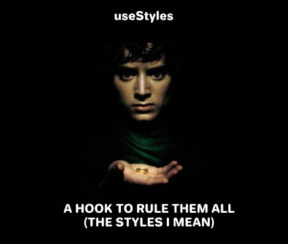

# useStyles: a hook to manage styles in React Native

¿Does anyone know how to properly manage styles in React Native? I don't.

I have been working with this framework for a couple of years now and couldn't get a concise way of using styles. This last year I've tried some libraries with novel concepts as Styled Components, but I couldn't get used to them. As a result of this dissatisfaction with the current alternatives, useStyles was born.

## What is useStyles and how can it help me?

Organizing styles in React Native can be tricky, a headache if you don't apply good programming practices. useStyles comes with the idea of ​​alleviating this burden by providing the tools so that you can generate applications where the styles have their own place and can reside harmoniously with the components.

If we summarize what useStyles does: it is a hook, which allows you to consume the styles of your application in a simple, clean and efficient way. So, if it appeals to you the idea of ​​improving the way you write your styles and thus generate cleaner applications, I invite you to visit the [repository](https://github.com/rootstrap/react-native-use-styles) and try it out for yourself.

## Usage

The following example shows how we would apply styles natively to generate a simple container with text inside.

https://gist.github.com/agustito37/cca8292de8f3639972af9d9130dc2784

Seen this way, it doesn't look like bad code, does it? Now, what happens when the component starts to grow.

The component a few weeks later, a few very rough weeks later:
https://gist.github.com/agustito37/d89db60561fbe5073e340f3b6c6c35b4

As you can see, our clean component began to be slowly eaten by our ugly styles. While there are many ways to improve this code, since React Native does not have a clear and simple way to handle styles, these bad practices get pretty common.

Now let's implement the same but with useStyles:
https://gist.github.com/agustito37/2f49201ea6f7a7cfce3318181f6e00c4

Excuse me :cry:. My eyes were filled with joy when I saw this organized code. Sniff. Maybe this reminds you a little bit of CSS styles. Although useStyles is inspired by CSS classes, this is a solution created especially for React Native; it has little to do with how CSS works.

Going back to the previous example, you can see how the useStyles' hook returns a function, which is then used to consume the styles. You may have already noticed some peculiar declarations, like a hook to which dependencies are passed, and some prefixes like `.`,`&`,`$`and`:`. Next, when we look at the definition of the styles, we'll see what they mean.

useStyles provides you with the `GlobalStyles` and `Styles` interfaces to define global and local styles.

Global styles:
https://gist.github.com/agustito37/7a41cb267e558ede30086575ef922ae6

Component's styles:
https://gist.github.com/agustito37/2759b5e981d2810ceb77bdfd36a1851a

We are not going to analyze in detail each one of the functionalities, for that, you can consult the [repository](https://github.com/rootstrap/react-native-use-styles). But in summary, they can be explained as follows:

- Constants (`$`): we can reuse them in other styles and components.
- Static styles (`.`): regular styles that can be reused in other styles and components.
- Computed styles (`&`): styles that depend on certain dependencies passed in the hook. If any dependency changes, these styles are re-computed.
- Paths (`:`): shortcuts to write styles; e.g., to define the property `backgroundColor: 'red'` you can use the path `bg:color:red`.

## Summary

useStyles is a library created with the purpose of solving a recurring problem that developers usually have in React Native: disorganized and invasive styles in our components. With useStyles we use a hook to consume the styles, which gives us a simple, clean, and efficient interface.

You're invited to check the [repository](https://github.com/rootstrap/react-native-use-styles) to see what else you can do with useStyles and check that this library will really ease your work as a developer. Of course, any contribution is welcome.

### References

[1] https://github.com/rootstrap/react-native-use-styles

[2] https://styled-components.com/
