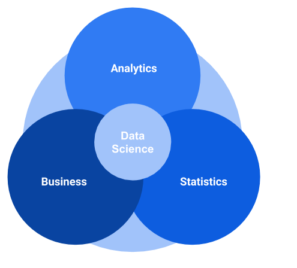
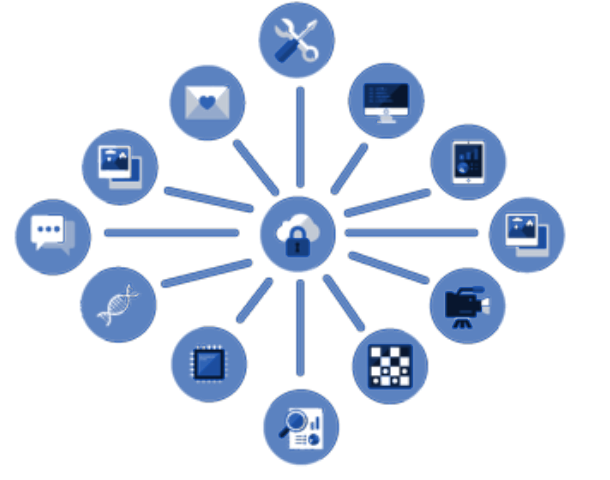
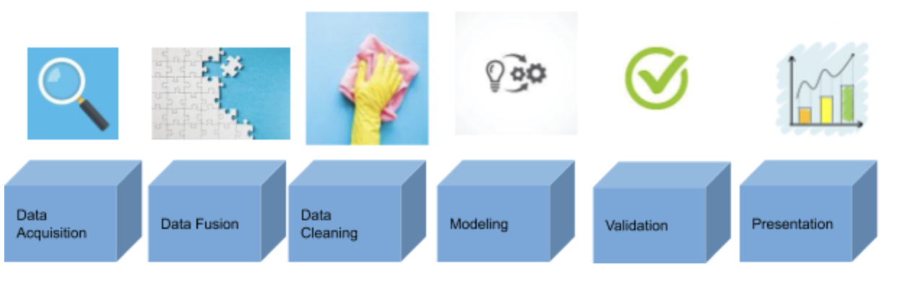

# WHAT IS DATA SCIENCE?

&nbsp;    

# Why should we care about Data Science? 
Nowadays more and more data is being generated by smartphones, social media, health, banks, stores, online services, governments, sensors, etc. Every piece of information is saved ‘just in case’. Thus, the available data cannot be processed by human’s brains, we need algorithms and mathematical processes that help us to make sense of the data. Unlocking the power of data is the key for the companies to succeed in this new world, where **everything is running behind the clock!**.  

A data scientist's job consists of finding answers to these questions:  
 
- **Why process the data?**  
- **What data to process?**   
- **How to process the data?**  
- **When to process the data?**       
&nbsp;  
Once the processing of the data is done, the icing on the cake is the interpretation of the results to provide value from the data. 
 
## What is Data Science?

Data science uses analytical methods and algorithms to extract knowledge and insights from structured and unstructured data. It involves understanding the business in order to get value from the data throughout analysis methods and algorithms based on statistics.   
 

## Business value   

### Why process data?     

First of all define the problem, if there is not a problem, there is no value. The value means the solution of the problem. So, start with a problem and then find the data that might resolve it.
Data by itself does not tell you anything, you would need to process or fusion with additional information.   

### What data?    
Choosing the correct data is important. Sometimes with the huge amount of data around, it is easy to get lost. Filtering and selecting the right piece of information is crucial to develop a good model and resolve the problem. You need to keep it simple and use only the relevant information. Models with too many features turns out complicated to run and also to understand.

### Where is the data coming from?     
**Data is everywhere!**. We are constantly generating data, everyday, everytime. Many sources might be in play, here are a few examples:    
- Social networks   
- Data generated from devices and sensors    
- Tracking location    
- Customers’ history: profile, purchases, activity    
- Population data      
- Images     
- Videos   
- Text    
- Calls    
- Cell Phones    
- Geospatial images   
- Transactions   

## How to get value from data?    
It is very important to understand the business to generate value from the data. Once this goal is reached, it is time to process and analyze the data and provide value either for your company, other companies or clients. In this way, data transforms into economical benefits!. This process is called **monetization**. 

According to Russell Walker in the book "From Big Data to Big Profits Success with Data and Analytics", there are four ways in which data can be monetized.

- **Keep the Data Proprietary:** for internal operations, including detection of opportunities to improve, automate processes or optimize services.
Trade data with business partners: trade data with partners in exchange for some benefit. For instance, Amazon and UPS share data between each other to provide a better service to the customer.   

-  **Data product:**    
	- **Sell data product to asset owners:** the data can be sold to the company/client that generates the data. For example, if a camera counts the amount of cars in the parking lot of Walmart might be useful for Walmart.  
	- **Sell a data product to other parties:** the data can also be sold to other companies. For instance, the information of the amount of cars at Walmart’s parking lot might be useful to its competitors such as Target. Therefore, Walmart might want to not only buy that information to make internal decisions, but also to have exclusivity rights over that data, making sure that the competitors will not take advantage. 
	- **Sell data product as premium access:** the access to certain data can be restricted to the customers that are willing to pay for it. For example, in the case of Linkedin, if the customer pays a fee, is able to see more information.  

- **Make data available (even free) to many users:** Make the service available for users and get money by advertisements. This is a strategy used by social media.
  
## What companies do with the data?     
A short list of the most common applications is provided:    

- Sentiment analysis: extract subjective information from text that can determine people’s behavior or reactions.     
- Recommendations: recommendation systems are popular among companies such as Amazon or Netflix to suggest the user similar products that might be of their interest.    
- Location-based services: tracking users’ real time location provides valuable information for many businesses.     
- Forecasting: predicting future events such as weather, sales, errors and prices from past data.    
- Fraud detection: prevent property or many to be taken by false pretenses.   

## Who might want to apply Data Science and how?
The amount of business areas that are taking advantage of data is huge, some of them are listed below. All of them have a direct impact on our day to day life, and we do not even realize.  

- **Healthcare:** analyze medical images to find patterns that might help doctors to predict diseases and accelerate treatments. Another application in healthcare is the analysis of data from genomas for deeper understanding of genetic issues. There are considerable examples that might help doctors to give a faster and more accurate response.   
  
- **Banks:** analyze customer’s behavior for fraud detection and improving customer service (customer profiling and target marketing). 

- **Supermarkets/Online stores:** forecast the future and find patterns by analyzing past information and develop more efficient campaigns and promotions. 
- **Governments:** several are the applications in governments with the purpose of ensuring more security and faster services like fraud detection, improve traffic, do paperwork more efficiently, etc.
- **Software companies:** any software company that handles lots of services which communicate between each other might be interested in using some machine learning algorithm to automate and optimize the work and detect errors. For instance, in AIOPs machine learning is used to automatically detect anomalies and prevent systems from cascade failures. 
- **Sports:** predict goals and analyze other teams' data.
- **E-commerce:** personalized pricing according to characteristics of clients. 
- **Social networks:** target marketing with ads to offer clients what they might want

# Privacy and Ethics
It is crazy the amount of information that is being stored and used without the real consent of the users. The regulations about how to handle data are not clear. There are too many questions to be resolved around the data privacy and what is ethical or not. 

- Who is the ownership of the data?
- Who controls the data?
- How data can/cannot be used?
- Can data be sold or exchanged? 

Those questions still need to be answered, meanwhile companies take advantage on their behalf. 
The European Union has done some work regarding this issue. [General Data Protection Regulation](https://en.wikipedia.org/wiki/General_Data_Protection_Regulation) is a regulation law on data protection and privacy for all individuals of the European Union and European Economic Area.

We, the users, are not aware of the power that data can have. Sharing everything to everyone, accepting all the agreements without reading. It is not the users' fault, it is not the companies’ fault. But the reality is that the process is not being transparent for the users, and companies are using the data without actual consent. This is a hot topic that misses a final solution. 

# How to develop a Data Science project?
Now that we know what Data Science is and when we should use it, we need to know which are the steps to follow when developing this type of project. The concept of MVP (A minimum viable product) can be also applied to Data Science projects. An MVP is a first version of a product with enough functionalities that satisfy customers, who can provide feedback for future iterations of the product development.  Here are some pieces of advice that will make your life easier when developing a Data Science project.

**Define the problem**    
Focus first on resolving a problem! It is not a good idea to force the data to be your problem. Instead, define the problem well and find the data that can help you to resolve it. In addition, validate with other people that this problem is a need. 

**Start simple!**     
- Simple model: You should start with a simple model and then during iterations increase the complexity and improve the performance.    
- Simple platform: In the same way, you can start with a simple platform to run your models, and as soon as you need higher computational time use other tools for the execution of the model.     

## Data Science pipeline
A basic pipeline is shown in the figure below. Starting from selecting the data to be processed (data acquisition), sometimes different sources are necessary to be integrated (data fusion), then missing values and some transformations take place (data cleaning). Sometimes the data needs to be normalized in order to take the data to the same scale and be ready to perform the model (modeling). Once the model is executed, it should be evaluated to validate its performance (validation). Finally, the results from the model should be interpreted and presented. 

From all the data available which is useful? All data captured from different applications and devices can be useful. The main idea is to focus on the problem, and think about how the data can help to resolve it. *Do not focus on the data*, that is the first mistake. Otherwise, you risk investing money and time on something that is not valuable for anything and for anyone.
### How to prepare the data?
Firstly, the data needs to be captured and stored, then it needs to be integrated with other datasets, and finally the data cleaning process prepares the input for the algorithms. 

- **Data capture:** the data can be captured in two ways: active and passive. The active mode refers to the case when people are aware that their data is being captured. When the data is captured passively means that the people are not aware of the capture. 
- **Data fusion:**  sometimes the data can be in different sources or formats, while each piece of information is not useful by itself, if they are combined can generate value. The process of combining data is called data fusion. 
- **Data cleaning:** the process of data cleaning consists of the preparation of the data to be ready for the execution of the algorithms. This process takes the majority of a Data Scientist’s day-to-day work, but is fairly important. If the input of the algorithms is incorrect, the results obtained would be wrong and can lead to bad decisions. The data cleaning process consists of diverse activities such as standardizing the values, resolving missing values and outliers. Further details for this process can be found here.

# Conclusion
Nowadays, with all the data that is continuously being generated, the number of areas that data science techniques can be applied to generate insights from the data is vast. Furthermore, many businesses in the future will not be able to compete if these techniques are absent. Thus, users will be expecting better services improved by these technologies. Either the users are customers from any services from online stores to banks or the users are citizens that expect that the government provides better services. 

